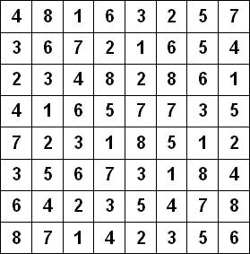
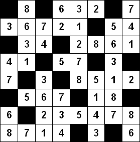

# Hitori

## Autor

| **Nombre y Apellidos** |         **Correo**         |               **GitHub**               |
| :--------------------: | :------------------------: | :------------------------------------: |
|  Ariel Plasencia Díaz  | arielplasencia00@gmail.com | [@ArielXL](https://github.com/ArielXL) |

## Reglas

El Hitori se juega en una cuadrícula de celdas cuadradas. Al  principio, cada celda contiene un número. La meta deberá ser pintar algunas celdas para que no haya números duplicados en ninguna fila ni columna, semejante al estado resuelto de un Sudoku (excepto por los cuadros negros añadidos a la cuadrícula). Las conexiones ortogonales son importantes también; las celdas pintadas (de negro) no se pueden  conectar ortogonalmente, y las otras celdas se deben conectar  ortogonalmente en un solo grupo. Es decir, dos cuadros negros no pueden  estar adyacentes uno al otro, y todos los cuadros no pintados se deben  conectar, horizontalmente o verticalmente, para crear una sola forma. 

## Ejemplo

### Hitori sin resolver

### Hitori resuelto

